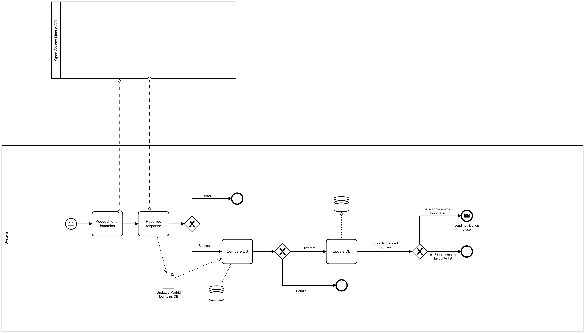
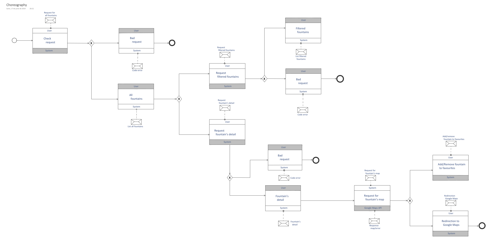
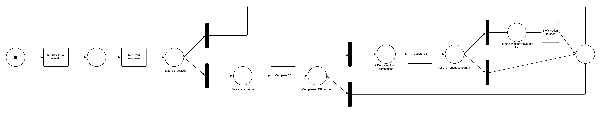

# FontYou
FontYou is a project for the Project Design and Services course from Politecnico di Milano.

Te project consists in the design and implementation of a service that provides to its consumers information about all the public fountains from Madrid, Spain. 

The goal is to encourage the use of the public fountains and bring a solution for the needs related to it to the users, like seeing a map with all the public fountains, get detailed information from each one and even have a list of favorites fountains.

To develop this project we have applied the Service Oriented Architecture and consists of the following parts:

- [FontYou](#FontYou)
  - [e-Service: BluePrint](#e-Service-BluePrint)
  - [BPM orchestration](#BPM-orchestration)
  - [BPM choreography](#BPM-choreography)

## e-Service: BluePrint

## BPM orchestration

## BPM choreography

## PetriNets - Soundness
