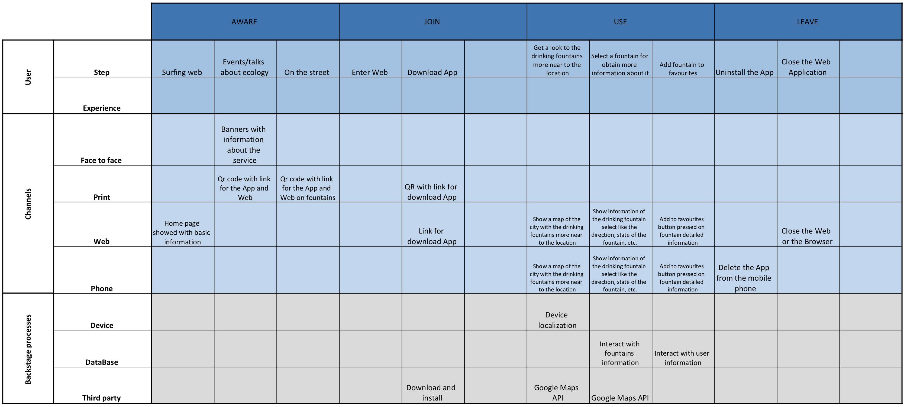

FontYou is a project for the [Project and Service Design course from Politecnico di Milano](https://www4.ceda.polimi.it/manifesti/manifesti/controller/ManifestoPublic.do?EVN_DETTAGLIO_RIGA_MANIFESTO=evento&aa=2019&k_cf=225&k_corso_la=481&k_indir=T2A&codDescr=095948&lang=IT&semestre=2&idGruppo=3925&idRiga=239686).

Te project consists in the design and implementation of a service that provides to its consumers information about all the public fountains from Madrid, Spain. 

The goal is to encourage the use of the public fountains and bring a solution for the needs related to it to the users, like seeing a map with all the public fountains, get detailed information from each one and even have a list of favorites fountains.

To develop this project we have applied the Service Oriented Architecture that consists of the following parts:

- [e-Service: BluePrint](#e-Service-BluePrint)
- [Business Process](#Business-Process)
  - [BPM orchestration](#BPM-orchestration)
  - [BPM choreography](#BPM-choreography)
  - [PetriNets - Soundness](#PetriNets---Soundness)

## e-Service: BluePrint

## Business Process
Our service has 3 actors involved: System, User and Google Maps API.
- **System**: main actor, our system.
- **User**: user using our system, as we don't know its behavior we define it as a black-box sending requests to our system.
- **Google Maps API**: an external service used by our own service (system). Therefore as we don't know its implementation we define it as a black-box too.

*As the size of the diagrams are so big, it's not be comfortable enough to see them attached on this document, therefore their link is provided to see them*

### BPM orchestration
  
  We provide 3 diagrams to define the entire orchestration diagram: the main high-level diagram, and then we have a deeper specification of the Use of System and the Check and Update fountain's information.
  - [Main diagram](docs/schemas/orchestration.png)
  - [Use of system diagram](docs/schemas/useOfSystem.png)
  - [Check and Update fountain's information diagram](docs/schemas/checkUpdateFountainsInformation.png)

### BPM choreography
With the BPM choreography diagram we define the communication between the different actors of our service.
- [BPM Choreography diagram](docs/schemas/choreography.png)

### PetriNets - Soundness
In order to validate our business process we have done the Workflow Net of the service and then check its soundness.
- [PetriNets diagram](docs/schemas/PetriNet.png)

We can confirm its soundness and its structural soundness as we accomplish:
- **Structural soundness**:
  - One and only initial node
  - One and only final node
  - Each node is in the path from the inital node to the final node
- **Soundness**: For any case the procedure will terminate eventually, and at the moment the procedure terminates there is a token in place 'o' all the other places are empty